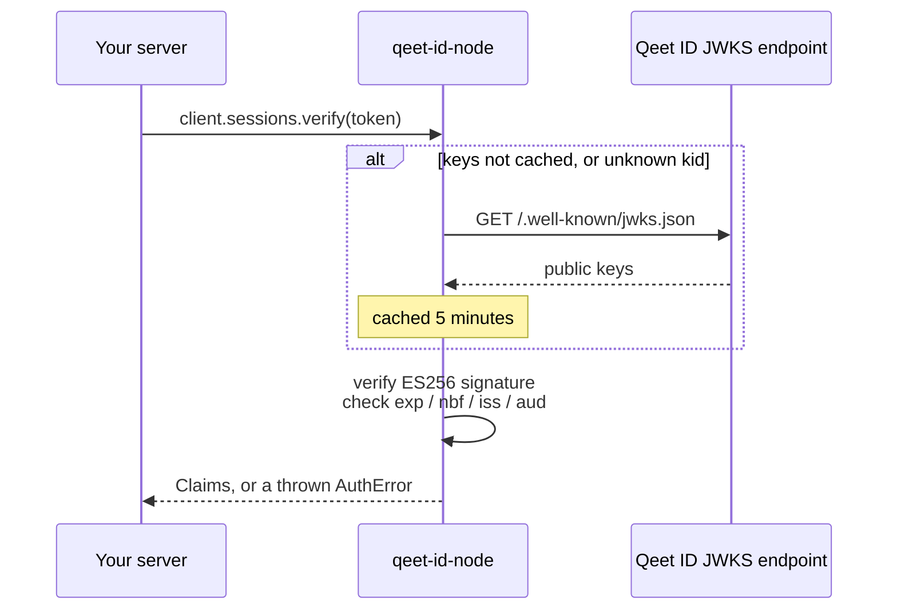
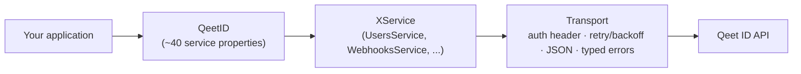

# qeet-id-node

[](package.json)
[](LICENSE)

The official server-side Node.js/TypeScript SDK for [Qeet ID](https://qeet.in) — the passkeys-first identity platform. One client, ~90 typed methods across users, organizations, roles, federation (OIDC/SAML/SCIM/LDAP), fine-grained authorization (RBAC/ReBAC/AuthZEN), AI-agent identities, compliance, and billing — with local JWT verification, automatic retries, auto-pagination, and webhook signature verification built in, on zero third-party dependencies.

```ts
const client = new QeetID({ apiKey: process.env.QEETID_API_KEY! });

const user = await client.users.create({ tenant_id: tenantId, email: "ada@example.com" });
const claims = await client.sessions.verify(token);
const allowed = await client.permissions.check({ user: claims.userId!, tenant: claims.tenantId!, permission: "billing:write" });
```

New to Qeet ID, or to CIAM SDKs in general? Read [Concepts](#concepts) first — it explains every acronym below in plain English before you touch any code.

---

## Table of contents

- [Concepts](#concepts) — start here if any of the jargon above is unfamiliar
- [Requirements](#requirements)
- [Installation](#installation)
- [Quick start](#quick-start)
- [Without vs. with this SDK](#without-vs-with-this-sdk)
- [Configuration](#configuration)
- [Resource reference](#resource-reference)
- [Core concepts, in code](#core-concepts-in-code)
  - [Session verification (local JWKS)](#session-verification-local-jwks)
  - [Choosing an authorization model](#choosing-an-authorization-model)
  - [Pagination](#pagination)
  - [Webhooks](#webhooks)
  - [Zero-config discovery](#zero-config-discovery)
  - [Error handling](#error-handling)
  - [Observability](#observability)
- [Architecture](#architecture)
- [Testing your integration](#testing-your-integration)
- [Examples](#examples)
- [Documentation](#documentation)
- [FAQ](#faq)
- [Versioning and compatibility](#versioning-and-compatibility)
- [Contributing](#contributing)
- [Security](#security)
- [Support](#support)
- [License](#license)

## Concepts

A quick glossary before the code, for anyone new to identity platforms — skip ahead if these are all familiar.

| Term                      | What it means here                                                                                                                                                                                                                                             |
| ------------------------- | -------------------------------------------------------------------------------------------------------------------------------------------------------------------------------------------------------------------------------------------------------------- |
| **Tenant / Organization** | A customer account on Qeet ID. Every user, role, and resource belongs to exactly one. This SDK calls the resource `organizations`; the wire format still says `tenant_id` — same thing, two names.                                                             |
| **API key** (`qk_…`)      | A long-lived secret your _backend_ uses to call the management API (create users, assign roles, ...). Never sent to a browser.                                                                                                                                 |
| **Session token**         | A short-lived token issued to an _end user_ after they log in. Your backend receives it on incoming requests and verifies it — that's what `sessions.verify` does.                                                                                             |
| **JWT / ES256**           | Session tokens are [JSON Web Tokens](https://jwt.io) signed with ES256 (an elliptic-curve algorithm). Signing means the token can't be forged; it doesn't mean it's secret — anyone can read the claims inside, only Qeet ID can produce a validly-signed one. |
| **JWKS**                  | JSON Web Key Set — the _public_ keys Qeet ID uses to sign tokens, published at a well-known URL. Verifying a token means checking its signature against a key in this set — no call back to Qeet ID needed once the keys are cached.                           |
| **RBAC**                  | Role-Based Access Control — "does this user have the `admin` role, which grants `billing:write`?" The model most apps start with.                                                                                                                              |
| **ReBAC**                 | Relationship-Based Access Control (Zanzibar/Google-Docs-style) — "can this user view this document _because_ they're in the `eng` group, which was granted `viewer`?" Answers questions RBAC can't: per-resource sharing, nested group inheritance.            |
| **AuthZEN**               | An open standard (OpenID) for a single authorization-check request/response shape that can be answered by _either_ RBAC or ReBAC underneath — useful if you want one call site that doesn't need to know which model decided.                                  |
| **Webhook**               | Qeet ID calling _your_ server when something happens (`user.created`, ...). You must verify the signature before trusting the payload — see [Webhooks](#webhooks).                                                                                             |

## Requirements

- **Node.js 18.17+** (global `fetch` and `node:crypto`'s `webcrypto` — no third-party HTTP or JWT library).
- A Qeet ID account and a server-side API key (`qk_…`) — see [qeet.in](https://qeet.in) to create one.

## Installation

```bash
npm install @qeet-id/node
# or: pnpm add @qeet-id/node / yarn add @qeet-id/node
```

```ts
import { QeetID } from "@qeet-id/node";
```

## Quick start

```ts
// index.ts
import { QeetID } from "@qeet-id/node";

// 1. Build one client, backed by your secret API key. Reuse it for the lifetime of your process — it's safe for concurrent use.
const client = new QeetID({
  apiKey: process.env.QEETID_API_KEY!, // a server-side qk_… key
});

// 2. Every method returns a Promise and throws ApiError on failure — no result/error tuples, no silent swallowing of a 404 or a bad request.
async function main() {
  const user = await client.users.create({
    tenant_id: process.env.QEETID_TENANT_ID!,
    email: "ada@example.com",
    name: "Ada Lovelace",
  });
  console.log("created", user.id);
}

main().catch((err) => {
  console.error(err);
  process.exit(1);
});
```

> [!WARNING]
> **Never** embed an API key in client-side code (browser, mobile). This SDK is for servers, workers, and CLIs only — it authenticates with a secret key that must never leave your backend.

## Without vs. with this SDK

The most common real-world task — verifying a session token on every incoming request — makes the difference concrete. Both snippets do the same thing; only one of them is safe to ship.

<table>
<tr><th>Without this SDK</th><th>With this SDK</th></tr>
<tr valign="top">
<td>

```ts
// You'd have to: fetch JWKS, cache it, find the right key by kid, refresh on rotation, decode the JWT, verify the ES256 signature, check exp/nbf/iss/aud, and reject alg:"none"/"HS256" tokens (a real vulnerability class) — all before you even look at the claims.
const res = await fetch(issuer + "/.well-known/jwks.json");
// ...decode JWKS...
// ...parse JWT header, find matching kid...
// ...verify ES256 signature by hand with node:crypto...
// ...check exp, nbf, iss, aud manually...
// ...decide what to do on an unknown kid...
```

~60-100 lines, and every one of those steps is a place to get a security-relevant detail wrong.

</td>
<td>

```ts
try {
  const claims = await client.sessions.verify(token, {
    issuer,
    audience,
  });
  // use claims.userId / claims.tenantId
} catch {
  // invalid, expired, wrong issuer/audience, or an unsupported alg — all rejected
  res.status(401).end();
}
```

One call. JWKS caching, key rotation, and the alg-confusion guard are handled for you.

</td>
</tr>
</table>

## Configuration

```ts
const client = new QeetID({
  apiKey: process.env.QEETID_API_KEY!, // required
  baseUrl: "https://api.id.qeet.in", // default; override for self-hosted
  timeoutMs: 10_000, // default per-request timeout
  maxRetries: 2, // default; 429 + 5xx on idempotent calls
  headers: { "X-Trace-Id": traceId }, // sent on every request
  userAgent: "myapp/1.2.0", // prepended to the SDK's own User-Agent
  fetch: myCustomFetch, // custom fetch implementation (proxying, mocking in tests, ...)
  logger: myLogger, // optional per-request observability hook
});
```

| Field        | Default                  | Notes                                                                                       |
| ------------ | ------------------------ | ------------------------------------------------------------------------------------------- |
| `apiKey`     | — (required)             | Server-side secret key                                                                      |
| `baseUrl`    | `https://api.id.qeet.in` | Override for self-hosted deployments                                                        |
| `timeoutMs`  | `10_000`                 | Per-request timeout                                                                         |
| `maxRetries` | `2`                      | Retry budget for `429`/`5xx` on idempotent requests                                         |
| `headers`    | none                     | Sent on every request; cannot override `Authorization`/`Accept`/`Content-Type`/`User-Agent` |
| `userAgent`  | none                     | Prepended to (not replacing) the SDK's own UA string                                        |
| `fetch`      | global `fetch`           | Full transport override — proxying, custom `Agent`, mocking in tests                        |
| `logger`     | none (no-op)             | Per-request observability hook, see [Observability](#observability)                         |

Build once, reuse everywhere — `QeetID` is safe for concurrent use.

## Resource reference

Every resource is a property directly on `QeetID` — one property access away, no nesting required. The categories below are documentation groupings only (comment banners in `client.ts`, and the `src/` folder layout), not distinct TypeScript types — they exist so this table (and your mental model) has a shape, not because the type system enforces one.

<details open>
<summary><strong>Identity</strong> — who exists</summary>

| Property            | Manages                                                                                                      |
| ------------------- | ------------------------------------------------------------------------------------------------------------ |
| `users`             | Human user accounts — CRUD, bulk create/import, recycle bin, MFA reset, email/phone verification             |
| `organizations`     | Multi-tenant organizations                                                                                   |
| `servicePrincipals` | Machine identities for client-credentials (M2M) auth                                                         |
| `agents`            | AI-agent identities — ephemeral tokens, suspend/resume/decommission lifecycle, kill-switch, sponsor transfer |
| `domains`           | Custom domain verification                                                                                   |

</details>

<details open>
<summary><strong>Authentication</strong> — proving who's calling</summary>

| Property        | Manages                                                                                                                                          |
| --------------- | ------------------------------------------------------------------------------------------------------------------------------------------------ |
| `sessions`      | Local ES256 JWT verification against cached JWKS                                                                                                 |
| `oauth`         | RFC 8693 token exchange, RFC 7662 introspection, RFC 7009 revocation, RFC 8628 device flow, CIBA, signing keys, grants                           |
| `oidc`          | OIDC client CRUD, shadow-AI discovery/review                                                                                                     |
| `saml`          | SAML SSO connections (Qeet ID as the SP, connecting out to a tenant's IdP)                                                                       |
| `samlProviders` | External SPs registered against this tenant's SAML IdP (Qeet ID as the IdP — the mirror image of `saml`)                                         |
| `scim`          | Tenant-admin SCIM provisioning config                                                                                                            |
| `ldap`          | LDAP/AD connections, bind test, direct-authenticate passthrough                                                                                  |
| `social`        | Social-login provider config, linked identities                                                                                                  |
| `mfa`           | Admin-initiated MFA factor reset                                                                                                                 |
| `credentials`   | W3C Verifiable Credentials — issue, list, revoke, verify                                                                                         |
| `authHooks`     | HMAC-signed pre/post-login custom logic hooks (a multi-record collection)                                                                        |
| `authPolicy`    | Password rules, MFA requirement, session duration                                                                                                |
| `policy`        | Combined per-tenant security policy (IP lists, password rules, session/MFA settings) — an older, broader record alongside `authPolicy`/`ipRules` |
| `ipRules`       | IP allow/deny rules, a dry-run `check`, and enforcement on/off                                                                                   |
| `botDetection`  | Bot-traffic overview, scoring settings                                                                                                           |
| `riskSettings`  | Impossible-travel and device-reputation risk scoring, step-up MFA thresholds                                                                     |

</details>

<details open>
<summary><strong>Authorization</strong> — what they can do</summary>

| Property        | Manages                                                                                        |
| --------------- | ---------------------------------------------------------------------------------------------- |
| `roles`         | RBAC roles                                                                                     |
| `permissions`   | The RBAC permission catalog, a user's effective permissions, plus `check`/`checkAll`/`explain` |
| `groups`        | Group membership and group→role bindings                                                       |
| `relationships` | Zanzibar-style ReBAC — relation tuples, recursive `check`, identity-graph `graph`              |
| `decisions`     | AuthZEN unified `/evaluation` — one shape fronting both RBAC and ReBAC                         |

</details>

<details open>
<summary><strong>Administration</strong> — tenant operations</summary>

| Property         | Manages                                                                            |
| ---------------- | ---------------------------------------------------------------------------------- |
| `branding`       | Hosted-login branding                                                              |
| `invitations`    | Org invitations                                                                    |
| `emailTemplates` | Transactional email templates                                                      |
| `apiKeys`        | Server-side API keys                                                               |
| `vault`          | Encrypted secrets store                                                            |
| `tokenVault`     | Connected third-party OAuth accounts held on behalf of your users                  |
| `webhooks`       | Webhook subscriptions, deliveries, retries                                         |
| `auditLogs`      | Hash-chained audit log — read, free-text search, chain `verify`, anomaly detection |
| `analytics`      | Dashboard KPI overview                                                             |
| `gdpr`           | Erasure and data-export requests                                                   |
| `billing`        | Plans, subscription, invoices, checkout                                            |
| `retention`      | Data-retention policy                                                              |
| `rateLimits`     | Per-tenant rate-limit overrides                                                    |
| `logSinks`       | SIEM log forwarding                                                                |
| `adminLinks`     | Delegated admin-portal links                                                       |

</details>

```ts
const role = await client.roles.create(tenantId, { name: "editor" });
await client.roles.assignToUser(userId, tenantId, role.id);
```

## Core concepts, in code

### Session verification (local JWKS)

`sessions.verify` checks a Qeet-issued token's ES256 signature against the issuer's JWKS, then validates expiry/issuer/audience. The point of doing this _locally_ rather than calling Qeet ID on every request: once the keys are cached, verification is a CPU operation, not a network round trip.



```ts
try {
  const claims = await client.sessions.verify(token, {
    issuer: "https://api.id.qeet.in",
    audience: "https://your-api.example.com",
  });
  console.log(claims.userId, claims.tenantId, claims.scope);
} catch {
  res.status(401).end();
}
```

### Choosing an authorization model

You don't have to pick one — most apps use RBAC for coarse admin/member roles and add ReBAC only where per-resource sharing shows up (documents, projects, tickets). Use this table to decide where a given check belongs:

| Question you're answering                                 | Model   | Method                |
| --------------------------------------------------------- | ------- | --------------------- |
| "Does this user's _role_ grant this permission?"          | RBAC    | `permissions.check`   |
| "...and _why_ — which role, direct or via a group?"       | RBAC    | `permissions.explain` |
| "Can this user access _this specific_ document/project?"  | ReBAC   | `relationships.check` |
| "Who — or what group — can reach this resource, and how?" | ReBAC   | `relationships.graph` |
| "One call site, don't care which model answers it"        | AuthZEN | `decisions.evaluate`  |

```ts
// RBAC — role-based checks, with an explainable grant path.
const allowed = await client.permissions.check({ user: claims.userId!, tenant: claims.tenantId!, permission: "billing:write" });
const explanation = await client.permissions.explain({ user: claims.userId!, tenant: claims.tenantId!, permission: "billing:write" });

// ReBAC — Zanzibar-style relationship tuples, resolved recursively.
await client.relationships.create(tenantId, { object: "document:readme", relation: "viewer", subject: "group:eng#member" });
const result = await client.relationships.check(tenantId, { object: "document:readme", relation: "viewer", user_id: userId }, true); // explain=true

// AuthZEN — one standard request/response shape fronting both models.
const decision = await client.decisions.evaluate(tenantId, {
  subject: { type: "user", id: userId },
  resource: { type: "document", id: "readme" },
  action: { name: "view" },
});
```

### Pagination

Every listable resource has an `all(...)` async generator that walks pages lazily. Break out of the loop and paging stops immediately — no wasted requests for collections you only need the first few items from.

```ts
for await (const user of client.users.all({ tenant: tenantId })) {
  console.log(user.email);
}
```

The lower-level `list(...)` returning `{ data, nextCursor }` is still available if you want to drive the cursor yourself (e.g. rendering one page per HTTP request in your own API).

### Webhooks

Qeet ID calling your server is only trustworthy once you've checked the signature — anyone can `POST` a fake payload to a public URL. Always verify against the **raw** request body, before any JSON re-serialization (which can reorder keys and invalidate the signature check) — this means configuring your framework to give you the raw body for this route.

```ts
// Express, with a raw-body route: app.post("/webhooks/qeet", express.raw({ type: "application/json" }), handler)
import { constructEvent } from "@qeet-id/node";

function handler(req: Request, res: Response) {
  try {
    const event = constructEvent(
      req.body, // a Buffer — express.raw() gives you the raw bytes, not a parsed object
      req.header("x-qeet-signature"),
      req.header("x-qeet-event"),
      process.env.QEETID_WEBHOOK_SECRET!,
    );
    if (event.type === "user.created") {
      // event.payload is already parsed JSON
    }
    res.sendStatus(200);
  } catch {
    res.status(400).send("bad signature");
  }
}
```

`verifyWebhookSignature(payload, sigHeader, secret)` is available if you only need the check-and-throw without the parsed event.

### Zero-config discovery

If you self-host Qeet ID and don't want to hardcode where JWKS lives, fetch it from the standard OIDC discovery document instead:

```ts
import { discover, createFromDiscovery } from "@qeet-id/node";

const doc = await discover("https://api.id.qeet.in");

// Or build a client that self-wires JWKS from discovery — useful for self-hosted instances serving JWKS on a non-default path.
const { client, discovery } = await createFromDiscovery({
  apiKey: process.env.QEETID_API_KEY!,
  baseUrl: "https://id.acme.internal",
});
```

### Error handling

Every failed API call throws an `ApiError` — never a generic `Error` you have to guess the shape of, never a silent `undefined`. Catch it and inspect it:

```ts
import { ApiError } from "@qeet-id/node";

try {
  await client.users.get(id);
} catch (err) {
  if (err instanceof ApiError) {
    if (err.isUnauthorized()) {
      // 401 — bad or expired API key
    } else if (err.isForbidden()) {
      // 403 — API key lacks scope for this call
    } else if (err.isNotFound()) {
      // 404 — the resource ID doesn't exist
    } else if (err.isRateLimited()) {
      await new Promise((r) => setTimeout(r, (err.retryAfterSeconds ?? 1) * 1000));
    }
    console.error(`qeetid error ${err.status} ${err.code} (request ${err.requestId})`);
  }
  throw err;
}
```

`err.requestId` is the value to quote in a support ticket — it's echoed from the `X-Request-Id` response header on every call.

### Observability

`logger` is an optional hook invoked once per request, after retries settle, with method/path/status/duration/request-ID. Implement it with whatever structured logger you already use — the SDK core has zero logging dependencies, so adopting it never pulls in `pino`/`winston` on your behalf.

```ts
import type { Logger } from "@qeet-id/node";

const pinoLogger: Logger = {
  logRequest({ method, path, status, durationMs, requestId }) {
    logger.info({ method, path, status, durationMs, requestId }, "qeetid request");
  },
};
```

## Architecture



The public API is one package; resource files are grouped into four category folders under `src/` for navigability, but every service is still a flat property on `QeetID` — the folders don't appear in the API shape. Shared HTTP/crypto machinery lives in `src/transport/` and `src/utils/`, each independently unit-tested. See [docs/architecture/ARCHITECTURE.md](docs/architecture/ARCHITECTURE.md) for the full breakdown, and [docs/design-decisions/](docs/design-decisions/) for the trade-offs behind the flat client-property API, the throw-not-tuple error convention, and the snake_case wire-field decision.

## Testing your integration

The SDK doesn't ship a mock client — `fetch` and `baseUrl` in the config are the extension points. Pass a stub `fetch` for unit tests, or swap `baseUrl` for a sandbox/staging Qeet ID instance for integration tests:

```ts
const client = new QeetID({
  apiKey: "qk_test",
  fetch: async (url, init) => {
    // assert on url / init.method / init.body, then return canned JSON
    return new Response(JSON.stringify({ id: "u1", email: "a@b.com" }), { status: 200 });
  },
});
```

## Examples

Runnable examples live in [`examples/`](./examples), grouped the same way as the resources above:

| Example                                                                       | Demonstrates                                    |
| ----------------------------------------------------------------------------- | ----------------------------------------------- |
| [`authentication/verify-session`](./examples/authentication/verify-session)   | Verify a token + check a permission             |
| [`authentication/mfa`](./examples/authentication/mfa)                         | Reset a user's MFA factors                      |
| [`authorization/check-permission`](./examples/authorization/check-permission) | RBAC check with `explain`                       |
| [`authorization/relation-tuples`](./examples/authorization/relation-tuples)   | ReBAC tuple + Identity Graph                    |
| [`identity/users`](./examples/identity/users)                                 | Auto-paginate a large collection                |
| [`identity/organizations`](./examples/identity/organizations)                 | Create + list organizations                     |
| [`administration/webhooks`](./examples/administration/webhooks)               | Verify inbound webhooks                         |
| [`administration/auditlogs`](./examples/administration/auditlogs)             | Free-text search + chain verify                 |
| [`express`](./examples/express)                                               | Auth middleware + raw-body webhook route        |
| [`fastify`](./examples/fastify)                                               | Auth `preHandler` + webhook content-type parser |
| [`nextjs`](./examples/nextjs)                                                 | Route handler session verification (App Router) |
| [`hono`](./examples/hono)                                                     | Auth middleware on an edge-friendly framework   |

## Documentation

- [docs/architecture/ARCHITECTURE.md](./docs/architecture/ARCHITECTURE.md) — folder layout, why the client's properties stay flat
- [docs/design-decisions/](./docs/design-decisions/) — ADRs for the non-obvious calls
- [docs/FUTURE.md](./docs/FUTURE.md) — capabilities other CIAM SDKs have that Qeet ID's backend doesn't yet

## FAQ

**Do I need this SDK on my frontend?** No. This is a server-side SDK — it holds a secret API key that must never reach a browser. Frontend/mobile apps talk to Qeet ID's hosted-login flow directly; your backend uses this SDK to verify the resulting session token and manage your account data.

**What's the difference between an API key and a session token?** An API key (`qk_…`) is _yours_ — long-lived, identifies your backend to the management API. A session token is issued to _one of your end users_ after they log in — short-lived, verified with `sessions.verify`. See [Concepts](#concepts).

**Why does verification happen locally instead of calling Qeet ID?** Speed and resilience: once JWKS keys are cached (5 minutes, auto-refreshed on rotation), verifying a token is pure CPU — no added latency on your request path, and no outage risk if Qeet ID's API is briefly unreachable.

**What happens if my API key is compromised?** Revoke it immediately via `client.apiKeys.revoke(id)` or the Qeet ID console. See [SECURITY.md](./SECURITY.md) if the compromise is from a vulnerability in this SDK itself.

**Does this SDK retry on every error?** No — only `429` (rate limited) and `5xx` on idempotent requests (`GET`/`DELETE`). A `POST` that fails with a `5xx` is _not_ retried automatically, since the server may have already applied the mutation before failing — retrying blindly could double-create a resource. See [Configuration](#configuration) for `maxRetries`.

**Can I use this against a self-hosted Qeet ID instance?** Yes — set `baseUrl`, or use [`createFromDiscovery`](#zero-config-discovery) if your instance serves JWKS at a non-default path.

**Why are response fields snake_case (`created_at`) instead of camelCase (`createdAt`)?** A deliberate choice, not an oversight — see [ADR-0004](docs/design-decisions/ADR-0004-snake-case-wire-fields.md). It mirrors Stripe's Node SDK and avoids a case-conversion layer that could corrupt dynamic/free-form fields elsewhere in the SDK (policy `settings`, AuthZEN `context`, JWT claims).

## Versioning and compatibility

This SDK follows [Semantic Versioning](https://semver.org/). It is currently **pre-1.0** — minor versions may include breaking changes, documented in [CHANGELOG.md](./CHANGELOG.md). Once a resource's request/response shape stabilizes against the live backend, breaking it is treated as a real cost, not a free rename.

Supported Node.js versions: 18.17+ through current, matching the CI matrix in [.github/workflows/ci.yml](.github/workflows/ci.yml).

## Contributing

See [CONTRIBUTING.md](./CONTRIBUTING.md) for local setup, code conventions, and how to add a new resource.

## Security

See [SECURITY.md](./SECURITY.md) to report a vulnerability. Please don't open a public issue for security reports.

## Support

- **Bugs / feature requests:** [open an issue](https://github.com/qeetgroup/qeet-id-node/issues)
- **Qeet ID platform questions:** [qeet.in](https://qeet.in)
- **Security reports:** see [SECURITY.md](./SECURITY.md) — do not use public issues

## License

[MIT](./LICENSE)
